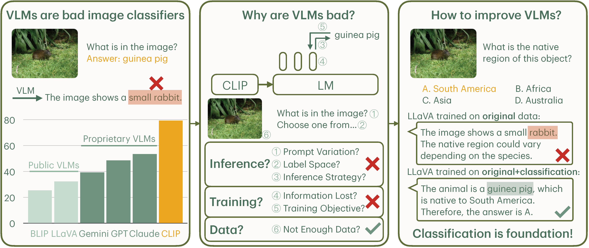

# Why are Visually-Grounded Language Models Bad at Image Classification?

[](https://lbesson.mit-license.org/)
[](https://www.python.org/downloads/release/python-311/)
[](https://pytorch.org/get-started/previous-versions/#v21)
[](https://github.com/ambv/black)

This repo provides the PyTorch source code of our paper: [Why are Visually-Grounded Language Models Bad at Image Classification?](https://arxiv.org/abs/2405.18415) (NeurIPS 2024). Check out project page [here](https://yuhui-zh15.github.io/VLMClassifier-Website/)!

## 🔮 Abstract

Image classification is one of the most fundamental capabilities of machine vision intelligence. In this work, we revisit the image classification task using visually-grounded language models (VLMs) such as GPT-4V and LLaVA. We find that existing proprietary and public VLMs, despite often using CLIP as a vision encoder and having many more parameters, significantly underperform CLIP on standard image classification benchmarks like ImageNet. To understand the reason, we explore several hypotheses concerning the inference algorithms, training objectives, and data processing in VLMs. Our analysis reveals that the primary cause is data-related: critical information for image classification is encoded in the VLM's latent space but can only be effectively decoded with enough training data. Specifically, there is a strong correlation between the frequency of class exposure during VLM training and instruction-tuning and the VLM's performance on those classes; when trained with sufficient data, VLMs can match the accuracy of state-of-the-art classification models. Based on these findings, we enhance a VLM by integrating classification-focused datasets into its training, and demonstrate that the enhanced classification performance of the VLM transfers to its general capabilities, resulting in an improvement of 11.8% on the newly collected ImageWikiQA dataset.

</img>

## 🚀 Getting Started

Please install the required packages:

- Inference-based environment: [vlmhf.yml](./vlmhf.yml)
- Training-based environment: [llava.yml](./llava.yml) for LLaVA and [lavis.yml](./lavis.yml) for BLIP

## 📄 Reproduce Paper Results

Please look at script files in each folder to reproduce the results in the paper:

- Section 2 (VLMs are Bad at Image Classification): [main_results](./main_results/)
- Section 3 (Why are VLMs Bad Image Classifiers): [inference_analysis](./inference_analysis/), [feature_analysis](./feature_analysis/), [data_analysis](./data_analysis/), [training_analysis](./training_analysis/) (**⚠️ we provide trained model checkpoints [here](https://drive.google.com/drive/folders/18KduIFfcEOwWy-qgU4imQE_0xxUPjro9?usp=sharing)**)
- Section 4 (Improving VLM with Classification Data): [imagewikiqa](./imagewikiqa/)


### 💎 Dataset: ImageWikiQA

Dataset is available at [here](./data/imagewikiqa.jsonl). Corresponding images can be downloaded [here](https://drive.google.com/drive/folders/18KduIFfcEOwWy-qgU4imQE_0xxUPjro9?usp=sharing).

## 🎯 Citation

If you use this repo in your research, please cite it as follows:
```
@article{VLMClassifier,
  title={Why are Visually-Grounded Language Models Bad at Image Classification?},
  author={Zhang, Yuhui and Unell, Alyssa and Wang, Xiaohan and Ghosh, Dhruba and Su, Yuchang and Schmidt, Ludwig and Yeung-Levy, Serena},
  journal={Conference on Neural Information Processing Systems (NeurIPS)},
  year={2024}
}
```
